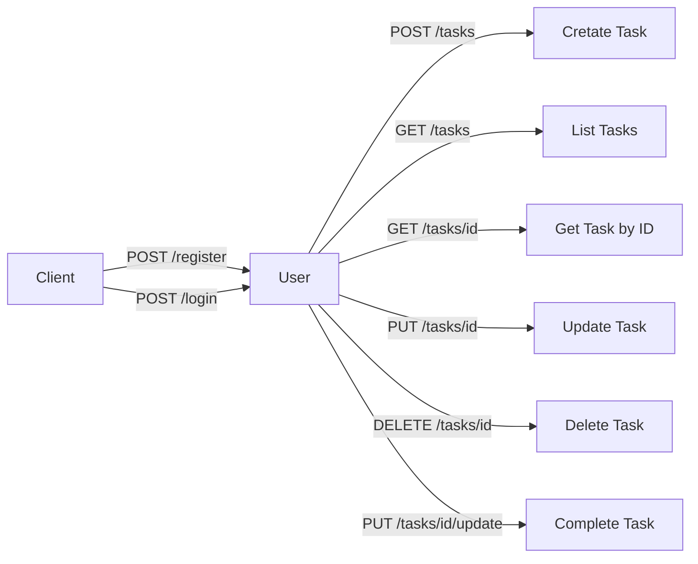
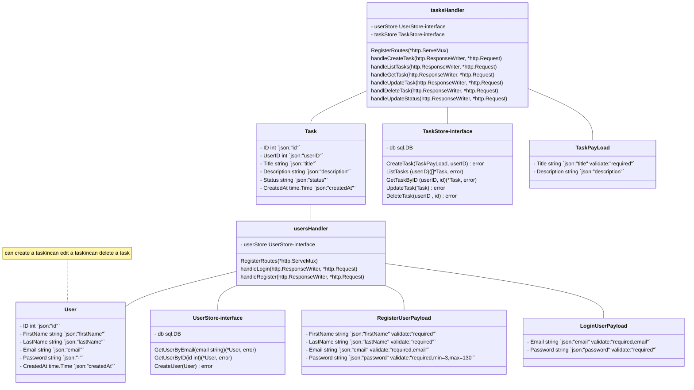

# Task API

This project provides a API Rest for managing tasks. It allows creating, updating, listing, completing, and deleting tasks.

## Table of Contents

- [Task API](#task-api)
  - [Table of Contents](#table-of-contents)
  - [Prerequisites](#prerequisites)
  - [Installation](#installation)
  - [Usage](#usage)
    - [Run the API](#run-the-api)
    - [Run Tests](#run-tests)
  - [API Endpoints](#api-endpoints)
  - [API Files Structure](#api-files-structure)
  
  - [Project Structure](#project-structure)
  - [API Flow Diagram](#api-flow-diagram)
  - [API Class Diagram](#api-class-diagram)
  - [Documentation](#documentation)
  - [License](#license)

## Prerequisites

- [Go](https://golang.org/doc/install) (version 1.22 or later)
- [Node.js](https://nodejs.org/en/download/) (for generating documentation using Redocly)
- [mySQL](https://dev.mysql.com/downloads/workbench/) (Create a database with the name "internship_project")

## Installation

Clone the repository:

```sh
git clone https://github.com/prbn97/internship-project.git
cd internship-project
```
## Usage

### Run the API
Use the Makefile to build and run the API:
```sh
make run
```
### Run Tests
```sh
make test
```

## API Files Structure
```plaintext
/taskstodo/
    + /cmd/
        - /api/
        - main.go
        - main.go
    + /configs/
        - env.go
    + /db/
        - db.go
    + /docs/
        - dayBookDevelopment.md
        - taskstodo-docs.html
        - openapi.yaml

    + /services/
        + /auth/
            - jwt.go
            - password.go
        + /models/
            - types.go
        + /task/
            - routes.go
            - store.go
        + /users/
            - routes.go
            - store.go
        + /utils/
            - routes.go


    - .env.example
    - Dockerfile
    - Dockerfile.dev
    - go.mod
    - go.sum
    - Makefile
    - README.md
```

## API Endpoints
- POST /register - Create a new user.
- POST /login - Sing-in in with user email and password
___
- POST /tasks - Create a new task.
- GET /tasks - List all tasks.
- GET /tasks/{id} - Get a task by ID.
- PUT /tasks/{id} - Update a task.
- DELETE /tasks/{id} - Delete a task
- PUT /tasks/{id}/complete - Mark a task as complete.
- PUT /tasks/{id}/incomplete - Mark a task as incomplete.
___

## API Flow Diagram


## API Class Diagram


## Documentation
API documentation is generated using Redocly. To view the documentation:

Generate the HTML documentation:

```sh
npx @redocly/cli build-docs docs/openapi.yaml --output docs/api-documentation.html
Open docs/api-documentation.html in a web browser.
```

## License
This project is licensed under the MIT License. See the LICENSE file for details.

## Explanation:

1. **Introduction**: Brief description of the project.
2. **Table of Contents**: Helps navigate through the README.
3. **Prerequisites**: Lists the software needed to run the project.
4. **Installation**: Instructions to clone and set up the project.
5. **Usage**: Explains how to run the project and tests using the Makefile.
6. **API Endpoints**: Lists the API endpoints with brief descriptions.
7. **Project Structure**: Provides an overview of the project's directory structure.
8. **API Flow Diagram**: Visual representation of the API endpoints using Mermaid.
9. **Documentation**: Instructions on how to generate and view the API documentation.
10. **License**: Information about the project's license.

This README provides a comprehensive guide for developers to understand, set up, and use your API.


